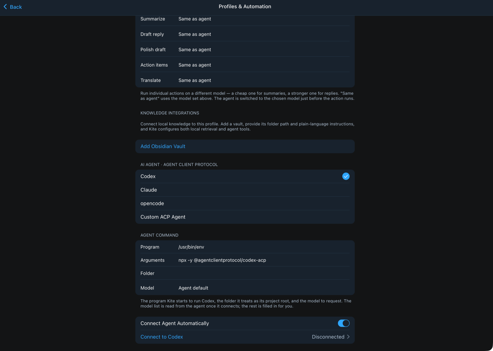
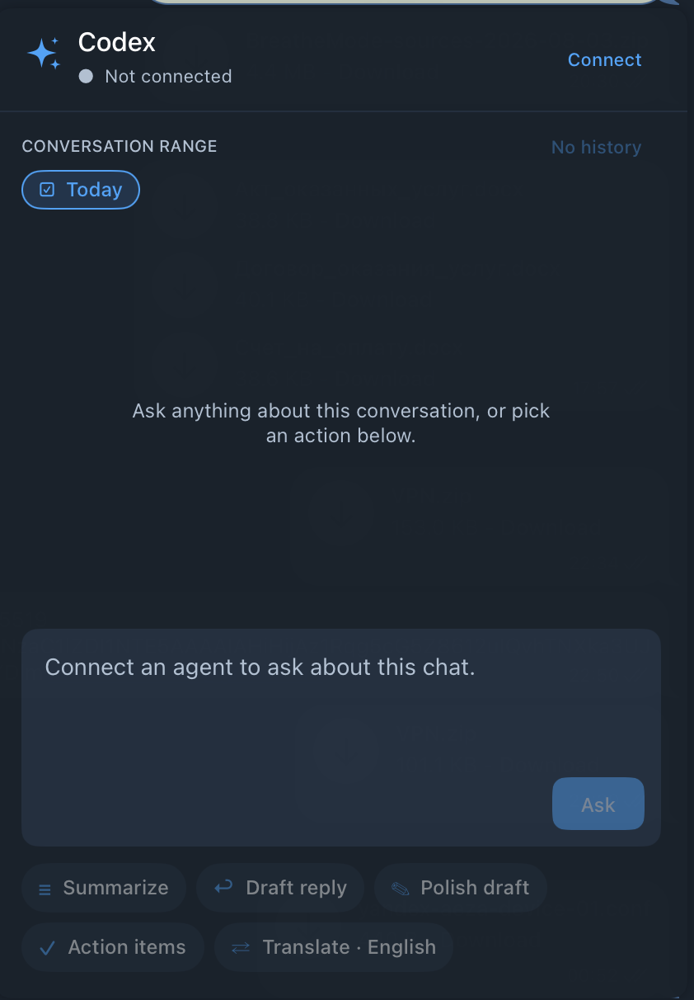

<div align="center">


# Kite

**A macOS Telegram client with a coding agent in the composer.**

Kite is a fork of [TelegramSwift](https://github.com/overtake/TelegramSwift) that adds two
things: **profiles**, which split one account into separate working contexts, and an **AI
panel** that runs a real agent — Codex, Claude, or opencode — against the conversation in
front of you.

[Install](README-INSTALL.md) · [LLM integration notes](docs/LLM_INTEGRATIONS.md) · [Building](INSTALL.md)

</div>

---

## Profiles

One Telegram account usually holds several unrelated lives: a job, a side project, family.
A profile is a saved slice of that account — a set of chat folders, plus its own agent setup.



- **Visible chat folders** — pick which folders a profile shows. Switching profile changes the
  chat list, so work chats are not sitting next to family chats.
- **Scoped search** — global search is restricted to the chats the active profile can see, so
  results from another context do not leak in.
- **Per-profile agent setup** — each profile keeps its own agent, model and enabled actions.

Everything lives under **Settings → Profiles & Automation**.

## The AI panel

The panel opens from the ✦ button in the composer, next to emoji and voice:


From there you run an action against the current conversation. The agent reads the chat; it
never sends anything. Results land in a review area, and you decide whether to use them.



| Action | What it does |
| --- | --- |
| **Summarize** | Condenses the conversation over the selected range |
| **Action items** | Pulls out commitments and open questions |
| **Draft reply** | Writes a reply for you to review before sending |
| **Polish draft** | Rewrites what you have already typed |
| **Translate** | Translates into a language you pick |
| **Voice to text** | Transcribes voice messages, optionally fully offline |
| **Generate image** | Generates an image and shows it inline |
| **Ask agent** | Anything else, in your own words |

Each action can be switched off in settings, so the panel only shows what you actually use.

**Conversation range.** Actions default to today. Turn *Today* off to use a saved range
instead — 3, 7 or 30 days.

**While it runs.** The panel reports what the agent is doing — thinking, writing, or the name
of the tool it called — and a request can be stopped at any point. Requests survive the panel
being closed, so you can start something long and come back to the result.

## Agents

Kite speaks [ACP](https://agentclientprotocol.com) (Agent Client Protocol) over stdio and
starts the agent as a child process. Nothing is sent to a Kite-operated server; the agent is
whatever you point it at.

| Agent | Command |
| --- | --- |
| Codex | `npx -y @agentclientprotocol/codex-acp` |
| Claude | `npx -y @zed-industries/claude-code-acp` |
| opencode | `opencode acp` |
| Custom | any ACP-speaking binary |

**Models come from the agent, not from a hardcoded list.** On connect, Kite asks the agent
what it offers and fills the picker from the answer, so a new model appears without waiting
for a Kite release. Two wire shapes are handled: the `models` object codex-acp reports, and
the `configOptions` list opencode uses.

**A different model per action.** Summarizing every chat with a frontier model is a waste;
drafting a careful reply with a small one is a false economy. Set a default, then override it
per action.

**Saved setups per agent.** Switching from Codex to Claude and back does not lose either
configuration — command, model and per-action overrides are kept for each.

## Local knowledge

Point a profile at a folder of Markdown — an Obsidian vault, or any notes directory — and the
agent can cite from it while it works. Retrieval is read-only and runs locally through a
bundled MCP adapter (`kite_knowledge_mcp.py`). Notes are treated as untrusted quoted data, so
text inside a note cannot redirect the agent.

## Local voice transcription

Voice-to-text can run entirely on your machine, against any OpenAI-compatible transcription
endpoint — [whisper.cpp](https://github.com/ggerganov/whisper.cpp), faster-whisper-server,
LocalAI and Speaches all expose the same API. Nothing leaves the machine, and it works
without Telegram Premium.

```sh
whisper-server -m ~/.whisper-models/ggml-base.bin \
  --host 127.0.0.1 --port 8080 \
  --inference-path /v1/audio/transcriptions --convert -l auto
```

Then enable it under **Settings → Profiles & Automation → Local transcription**.

## Building

```sh
git clone --recursive https://github.com/NcitDev/kite.git
cd kite
xcodebuild -workspace Telegram-Mac.xcworkspace -scheme Telegram -configuration Release build
```

Full prerequisites are in [INSTALL.md](INSTALL.md). To package a distributable build:

```sh
tools/package_kite.sh /path/to/Kite.app build/dist
```

## Permissions

Kite asks for the same permissions as upstream Telegram, and for the same reasons:
microphone (voice messages and calls), camera (profile pictures), location (sharing your
location), network access, and access to files you pick or download.

Additionally, Kite **starts the agent you configure as a child process**. That agent runs with
your user's privileges and can read the folders you point it at. Only configure agents you
trust.

## Forking

Kite follows the [fork requirements](https://github.com/overtake/TelegramSwift#forking)
upstream sets out, and if you fork Kite you inherit them:

1. **Get your own API ID.** Replace the credentials in
   `packages/ApiCredentials/Sources/ApiCredentials/Config.swift` with your own pair from
   [my.telegram.org](https://my.telegram.org) — the ones in the tree are not yours to ship.
2. **Don't call your fork Telegram**, and make sure users understand it is unofficial.
3. **Don't use Telegram's logo.** Kite's mark is a folded kite, not a paper plane, and it is
   indigo rather than Telegram blue.
4. **Follow the [security guidelines](https://core.telegram.org/mtproto/security_guidelines)** —
   your users' data and privacy depend on it.
5. **Publish your code.** The [GPL](LICENSE) requires it.

## Credits

Kite is a fork of [TelegramSwift](https://github.com/overtake/TelegramSwift) by
[overtake](https://github.com/overtake), which is the overwhelming majority of the work here.
Kite is not affiliated with, endorsed by, or connected to Telegram.

Licensed under the GNU General Public License, version 2.0 — see [LICENSE](LICENSE).
